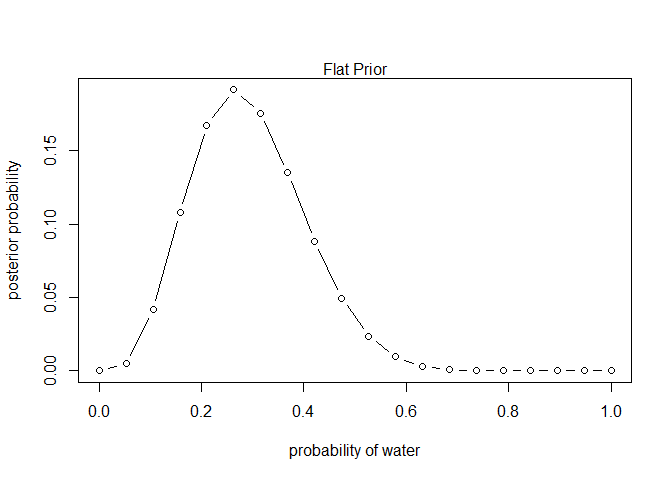
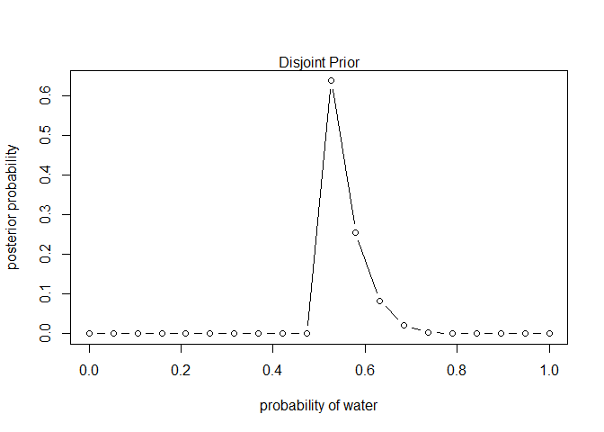

Assignment 1
================

## Question 1

Suppose the globe tossing data (Chapter 2) had turned out to be 4 water
in 15 tosses. Contruct the prior distribution, using grid apporximation.
Use the same flat prior as in the book.

``` r
# This is a copy from my notes
p_grid <- seq(from = 0, to = 1, length.out = 20)

# define prior
# our prior is flat
prior <- rep(1, times = 20)

# compute likelihood at each value in grid
# This is where we make the changes in our model.
likelihood <- dbinom(4, size = 15, prob = p_grid)

# compute product of likelihood and prior
unstd.posterior <- likelihood * prior

# standardize the posterior, so it sums to 1
posterior <- unstd.posterior/sum(unstd.posterior)

# Looking at the plot:
plot(p_grid, posterior, type = "b",
     xlab = "probability of water", ylab = "posterior probability")
mtext("Flat Prior")
```

<!-- -->

## Question 2

Start over in *1*, but now use a prior that is zero below
*p* = 0.5
and a constant above
*p* = 0.5
. This corresponds to prior information that a majority of the Earth’s
surface is water. What difference does the better prior make?

``` r
# This is a copy from my notes
p_grid <- seq(from = 0, to = 1, length.out = 20)

# define prior
# our prior is not flat, but defined as in question 2.
prior <- ifelse(p_grid < 0.5, 0, 5)

# compute likelihood at each value in grid
# This is where we make the changes in our model.
likelihood <- dbinom(4, size = 15, prob = p_grid)

# compute product of likelihood and prior
unstd.posterior <- likelihood * prior

# standardize the posterior, so it sums to 1
posterior <- unstd.posterior/sum(unstd.posterior)

# Looking at the plot:
plot(p_grid, posterior, type = "b",
     xlab = "probability of water", ylab = "posterior probability")
mtext("Disjoint Prior")
```

<!-- -->

A better prior appears to make a better answer to our question, it gives
us a better graph. Similarly, I think if we use appropriate priors, we
help set up our inference from the model for success.

## Question 3

We will compute the 89th percentile, and the HPDI intervals, using the
“RETHINKING” package.

``` r
library(rethinking)
```

    ## Loading required package: rstan

    ## Loading required package: StanHeaders

    ## Loading required package: ggplot2

    ## rstan (Version 2.21.2, GitRev: 2e1f913d3ca3)

    ## For execution on a local, multicore CPU with excess RAM we recommend calling
    ## options(mc.cores = parallel::detectCores()).
    ## To avoid recompilation of unchanged Stan programs, we recommend calling
    ## rstan_options(auto_write = TRUE)

    ## Do not specify '-march=native' in 'LOCAL_CPPFLAGS' or a Makevars file

    ## Loading required package: parallel

    ## rethinking (Version 2.13)

    ## 
    ## Attaching package: 'rethinking'

    ## The following object is masked from 'package:stats':
    ## 
    ##     rstudent

``` r
PI(posterior, prob = 0.89)
```

    ##        5%       94% 
    ## 0.0000000 0.2473451

``` r
HPDI(posterior, prob = 0.89)
```

    ##     |0.89     0.89| 
    ## 0.0000000 0.2550815

If we only consider the percentile with most common interval (PI in the
package) we are at risk of ignoring the shape of our probability
distribution, and instead of picking the most likely interval to contain
the actual proportion of water to the rest of the small world, we pick a
wider interval with equally weighted tails.

The Highest Posterior Density Compatibility (HDPI in the package) will
give us the narrowest interval that is most likely to contain our true
proportion of water in the small world. So not only is this answer more
likely, but it more closely follows the data and the probability curve.
