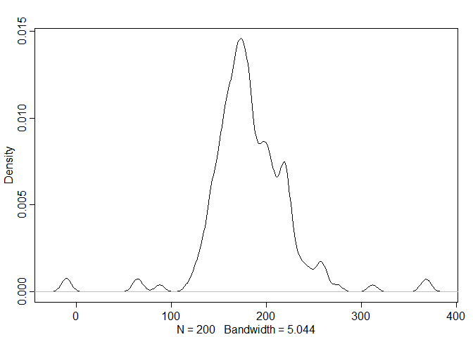
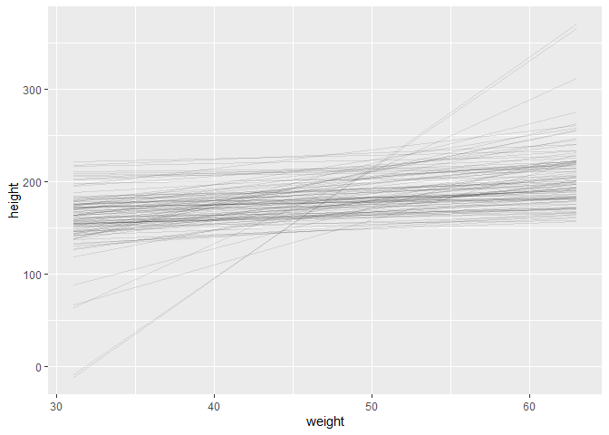
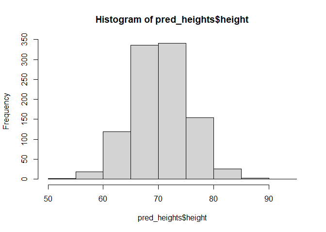

03Chapter - Statistical Rethinking Notes
================

## Question 1

> The weights listed below were recorded in the !Kung census, but
> heights were not recorded for these individuals. Provide predicted
> heights and 89% compatibility intervals for each of these individuals.
> That is, fill in the table below, using model-based predictions.

So, we look at the data from the !Kung census, by loading the proper
data:

``` r
library(rethinking)
```

    ## Loading required package: rstan

    ## Loading required package: StanHeaders

    ## Loading required package: ggplot2

    ## rstan (Version 2.21.2, GitRev: 2e1f913d3ca3)

    ## For execution on a local, multicore CPU with excess RAM we recommend calling
    ## options(mc.cores = parallel::detectCores()).
    ## To avoid recompilation of unchanged Stan programs, we recommend calling
    ## rstan_options(auto_write = TRUE)

    ## Do not specify '-march=native' in 'LOCAL_CPPFLAGS' or a Makevars file

    ## Loading required package: parallel

    ## rethinking (Version 2.13)

    ## 
    ## Attaching package: 'rethinking'

    ## The following object is masked from 'package:stats':
    ## 
    ##     rstudent

``` r
library(tidyverse)
```

    ## -- Attaching packages --------------------------------------- tidyverse 1.3.0 --

    ## v tibble  3.0.6     v dplyr   1.0.3
    ## v tidyr   1.1.2     v stringr 1.4.0
    ## v readr   1.4.0     v forcats 0.5.1
    ## v purrr   0.3.4

    ## -- Conflicts ------------------------------------------ tidyverse_conflicts() --
    ## x tidyr::extract() masks rstan::extract()
    ## x dplyr::filter()  masks stats::filter()
    ## x dplyr::lag()     masks stats::lag()
    ## x purrr::map()     masks rethinking::map()

``` r
data(Howell1)
data <- as_tibble(Howell1)
```

Then we create the prior, filtering heights for ages 18 and over only.

``` r
# filter out younger than 18

data <- data %>% 
  filter(age >= 18)
```

We consider the simple linear regression model used to predict the
effect of height on weight:

height = mu + beta1 \*(weight - avg\_weight)

``` r
# Simulate data
prior <- tibble(
  mu = rnorm(n = 1000, mean = 178, sd = 20),
  sigma = runif(n = 1000, min = 0, max = 50)
) %>% 
  # Here, we simulate the data distribution, based on what we decided our prior values to be
  mutate(height = rnorm(n = 1000, mean = mu, sd = sigma))

# Prior Predictive simulation:
# number of lines specified here:
N <- 100
prior <- tibble(
  n = 1:N,
  beta0 = rnorm(n = N, mean = 178, sd = 20),
  beta1 = rlnorm(n = N, meanlog = 0, sdlog = 1)
) %>%
  expand(nesting(n, beta0, beta1), weight = range(data$weight)) %>%
  # Here, we simulate the predictive distribution, based on our model above
  mutate(
    height = beta0 + beta1 * (weight - mean(data$weight))
  )
# We take a look at our prior predictive distribution
dens(prior$height)
```

<!-- -->

``` r
# We take a look at the prior predictive distribution lines
prior %>% 
  ggplot(aes(x = weight, y = height, group = n)) +
  geom_line(alpha = 0.10)
```

<!-- -->

``` r
avg_weight <- mean(data$weight)
model <- quap(
  alist(
    height ~ dnorm(mu, sigma),                   
    mu <- beta0 + beta1 * (weight - avg_weight), 
    beta0 ~ dnorm(178, 20),                      
    beta1 ~ dlnorm(0, 1),                        
    sigma ~ dunif(0, 50)                         
  ),
  data = data
)
```

We now have a model we can use to predict weights.  
So, using the entire distribution to predict weights..

``` r
new_indiv <- tibble(
  person = c("person1", "person2", "person3", "person4"),
  weight = c(45, 40, 65, 31)
)
# we simulate the possible predicted heights from each person
heights_predicted <- sim(model, data = list(weight = new_indiv$weight)) %>% 
  as_tibble() %>% 
  rename(
    "person1" = V1,
    "person2" = V2,
    "person3" = V3,
    "person4" = V4
  ) %>% ## FIXME Display table in a format that's easier to understand
  summarise(
    "p1mean" = mean(person1),
    "p2mean" = mean(person2),
    "p3mean" = mean(person3),
    "p4mean" = mean(person4),
    "p1prob" = PI(person1),
    "p2prob" = PI(person2),
    "p3prob" = PI(person3),
    "p4prob" = PI(person4)
  )
```

    ## Warning: The `x` argument of `as_tibble.matrix()` must have unique column names if `.name_repair` is omitted as of tibble 2.0.0.
    ## Using compatibility `.name_repair`.
    ## This warning is displayed once every 8 hours.
    ## Call `lifecycle::last_warnings()` to see where this warning was generated.

``` r
heights_predicted
```

    ## # A tibble: 2 x 8
    ##   p1mean p2mean p3mean p4mean p1prob p2prob p3prob p4prob
    ##    <dbl>  <dbl>  <dbl>  <dbl>  <dbl>  <dbl>  <dbl>  <dbl>
    ## 1   155.   150.   173.   142.   146.   142.   164.   134.
    ## 2   155.   150.   173.   142.   162.   158.   181.   151.

## Question 2

> Model the relationship between height (cm) and the natural logarithm
> of weight (log-kg): log(weight). Use the entire Howell1 data frame,
> all 544 rows, adults and non-adults. Use any model type from Chapter 4
> that you think useful: an ordinary linear regression, a polynomial or
> a spline. I recommend a plain linear regression, though. Plot the
> posterior predictions against the raw data.

We take a look at building the model using a similar approach as to
above.

``` r
# Prior Predictive simulation:
# Reload data to include under age 18 persons
data(Howell1)
data.log <- as_tibble(Howell1)

data.log$weight <- log(data.log$weight)

avg_weight <- mean(data.log$weight)

## FIXME model isn't scaling logarthmically
## Not sure how to do this one

model2 <- quap( # Fits the model
  data = data.log,
  alist( # Model Definition
    height ~ dnorm(mu, sigma),                   
    mu <-  beta0 + exp(log_b) * (weight - avg_weight), 
    beta0 ~ dnorm(178, 20),                      
    log_b ~ dnorm(0, 1),                        
    sigma ~ dunif(0, 50)                         
  )
)

# Predict heights according to model on the log scale
new_weights <- seq(range(data.log$weight))
pred_heights <- sim(model2, data = list(weight = new_weights)) %>% 
                    as_tibble() %>% 
                    rename(
                      "weight" = V1,
                      "height" = V2
                    )

# Plotting
hist(pred_heights$height)
```

<!-- -->

``` r
hist(data.log$height)
```

<!-- --> \#\#
Question 3

> Plot the prior predictive distribution for the polynomial regression
> model in Chapter 4. You can modify the the code that plots the linear
> regression prior predictive distribution. 20 or 30 parabolas from the
> prior should suffice to show where the prior &gt; probability resides.
> Can you modify the prior distributions of α, β1, and β2 so that the
> prior predictions stay within the biologically reasonable outcome
> space? That is to say: Do not try to fit the data by hand. But do try
> to keep the curves consistent with what you know about height and
> weight, before seeing these exact data.
