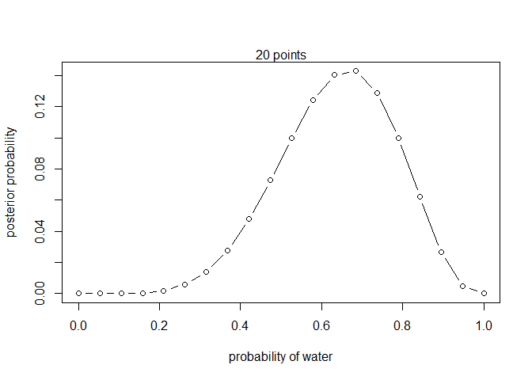
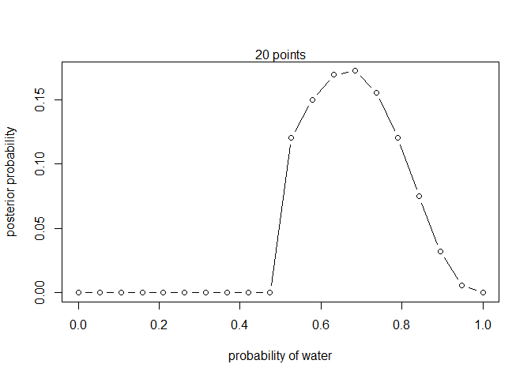
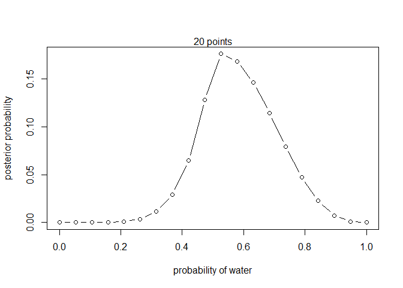

02Chapter - Statistical Rethinking Notes
================

## 2.2: Building a Model

The plausibility of (your assumption) after seeing (actual data) is
proportional to the ways that (your assumption) can produce (actual
data) multiplied by the prior plausibility of (your assumption).

An example of computing plausibilities on the garden of forking data:

``` r
# This is the raw counts of possible paths for the data in perspective of all our
# possible assumptions.
ways <- c(0, 3, 8, 9, 0)

# We compute the probabilities of each by dividing by the total number of possibilities.

ways/sum(ways)
```

    ## [1] 0.00 0.15 0.40 0.45 0.00

### Globe Tossing

Picking a prior is important, and the prior assumption can be flat.
Typically, this is used to mean that all possibilities are equally
likely in the scenario.

Sometimes it might be better to pick a couple different priors and try
them all.

In the example of the water vs land on a globe, the distribution of
probabilities is binomial, because there are only two possibilites;
landing on water, or on land.

We look at the grid approximation of the model as shown below:

``` r
# define grid
p_grid <- seq(from = 0, to = 1, length.out = 20)

# define prior
prior <- rep(1, 20)

# compute likelihood at each value in grid
likelihood <- dbinom(6, size = 9, prob = p_grid)

# compute product of likelihood and prior
unstd.posterior <- likelihood * prior

# standardize the posterior, so it sums to 1
posterior <- unstd.posterior/sum(unstd.posterior)

# Looking at the plot:
plot(p_grid, posterior, type = "b",
     xlab = "probability of water", ylab = "posterior probability")
mtext("20 points")
```

<!-- -->

Lets look at if we change the prior:

``` r
# define grid
p_grid <- seq(from = 0, to = 1, length.out = 20)

# define prior
prior <- ifelse(p_grid < 0.5, 0, 1)

# compute likelihood at each value in grid
likelihood <- dbinom(6, size = 9, prob = p_grid)

# compute product of likelihood and prior
unstd.posterior <- likelihood * prior

# standardize the posterior, so it sums to 1
posterior <- unstd.posterior/sum(unstd.posterior)

# Looking at the plot:
plot(p_grid, posterior, type = "b",
     xlab = "probability of water", ylab = "posterior probability")
mtext("20 points")
```

<!-- -->

Exponential

``` r
# define grid
p_grid <- seq(from = 0, to = 1, length.out = 20)

# define prior
prior <- exp(-5 * abs(p_grid - 0.5))

# compute likelihood at each value in grid
likelihood <- dbinom(6, size = 9, prob = p_grid)

# compute product of likelihood and prior
unstd.posterior <- likelihood * prior

# standardize the posterior, so it sums to 1
posterior <- unstd.posterior/sum(unstd.posterior)

# Looking at the plot:
plot(p_grid, posterior, type = "b",
     xlab = "probability of water", ylab = "posterior probability")
mtext("20 points")
```

<!-- -->
