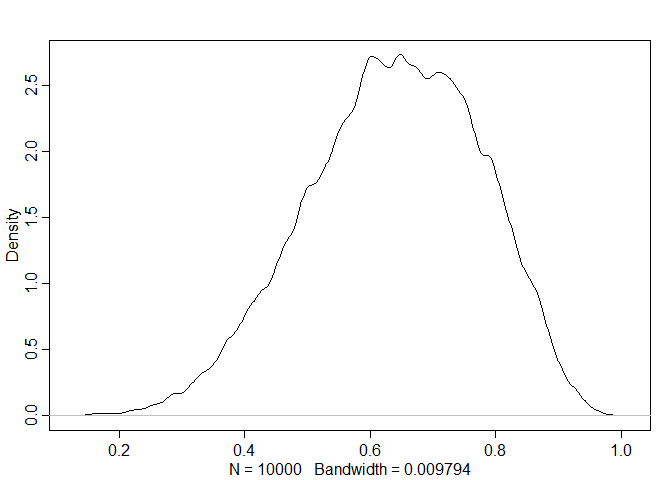

03Chapter - Statistical Rethinking Notes
================

We consider the case of the test for being a vampire. We want to know
how likely it is that given a positive test, the individual is a
vampire. We model this by the following:


")

Most people tend to intuit the normal response is to first measure the
number of positive tests, and then count the number of vampires within
that subset of people.

Using the probability rules to define it as something similar, applying
Baye’s Theorem:

 = \frac{Pr(\textnormal{positive} | \textnormal{vampire}) Pr(\textnormal{vampire})}{Pr(\textnormal{positive})} =
")

Pr(\textnormal{vampire}) + Pr(\textnormal{positive} | \textnormal{mortal})(1 - Pr(\textnormal{vampire}))
Pr(\textnormal{vampire} | \textnormal{positive})
")

We could look at this block, and it would be very confusing for most
people.

In essence, Bayesian Inference allows us to represent the world as it
is, rather than an estimation of true values with random chance error
that is thrown away. Bayesian inference lets us believe that parameters
exist on a probability distribution, while Frequentist theory would have
us limit this variation as a result of sampling error.

Sampling distributions disappear, and are replaced by probability
distributions. This is what people *thought* sampling distributions
were.

## Sampling from a grid approximate posterior

My goal is to copy most of the coding that he does in this chapter, in
an effort to better understand what it is he does here.

*Side note: I discovered how to replace all instances of a section of
code in a code block. It’s ctrl+alt+k.*

#### Example 1

``` r
# Create a grid
p_grid <- seq(from = 0, to = 1, length.out = 1000) 
# Create Prior (flat prior)
prob_p <- rep(1, 1000)
# Generate the probability distribution
likelihood <- dbinom(6, size = 9, prob = p_grid)
# Create the posterior from the probability distributions of the data and the prior
posterior <- likelihood * prob_p
# Standardize the posterior
posterior <- posterior / sum(posterior)

# now we sample the posterior
samples <- sample(p_grid, prob = posterior, size = 1e4, replace = TRUE)

plot(samples)
library(rethinking)
```

    ## Loading required package: rstan

    ## Loading required package: StanHeaders

    ## Loading required package: ggplot2

    ## rstan (Version 2.21.2, GitRev: 2e1f913d3ca3)

    ## For execution on a local, multicore CPU with excess RAM we recommend calling
    ## options(mc.cores = parallel::detectCores()).
    ## To avoid recompilation of unchanged Stan programs, we recommend calling
    ## rstan_options(auto_write = TRUE)

    ## Do not specify '-march=native' in 'LOCAL_CPPFLAGS' or a Makevars file

    ## Loading required package: parallel

    ## rethinking (Version 2.13)

    ## 
    ## Attaching package: 'rethinking'

    ## The following object is masked from 'package:stats':
    ## 
    ##     rstudent

<!-- -->

``` r
dens(samples)
```

<!-- -->

#### Summarizing Using Sampling

We want to add up all the probabilities that state the proportion of
water is less than 0.5

``` r
sum(posterior[p_grid < 0.5])
```

    ## [1] 0.1718746

This is to say about 17% of the posterior probability is below 0.5.

Now we use sampling:

``` r
sum(samples < 0.5) / 1e4
```

    ## [1] 0.1702

This is basically performing integration under the curve. We can also
ask how much posterior probability is in certain parameters:

``` r
sum(samples > 0.5 & samples < 0.75) / 1e4
```

    ## [1] 0.6076

## Defining the Mass of the interval

we want to know at what point we reach 80% of the probabilities:

``` r
quantile(samples, 0.8)
```

    ##       80% 
    ## 0.7597598

Now if our data is skewed, we have to be careful we understand what this
means. We generate a new posterior with a skew:

``` r
# Create a grid
p_grid <- seq(from = 0, to = 1, length.out = 1000) 
# Create Prior (flat prior)
prob_p <- rep(1, 1000)
# Generate the probability distribution
likelihood <- dbinom(3, size = 3, prob = p_grid)
# Create the posterior from the probability distributions of the data and the prior
posterior <- likelihood * prob_p
# Standardize the posterior
posterior <- posterior / sum(posterior)

# now we sample the posterior
samples <- sample(p_grid, prob = posterior, size = 1e4, replace = TRUE)
```

And we find the middle 50% of the distribution:

``` r
PI(samples, prob = 0.5)
```

    ##       25%       75% 
    ## 0.7057057 0.9299299

Then we find the percentile interval with the highest density with 50%
of the distribution:

``` r
HPDI(samples, prob = 0.5)
```

    ##      |0.5      0.5| 
    ## 0.8388388 1.0000000

Remember this is more computationally intensive than using PI.

This is called a compatibility interval.

## Expected Loss

We don’t necessarily care what the true value of a parameter is, only
that we have a “close enough” approximation of it. This definition will
vary from problem to problem.

Computing the expected loss:

``` r
# we take the sum of the probability for each value minus the parameter

loss <- sapply(p_grid, function(d) sum(posterior * abs(d-p_grid)))

# find the minimum in the loss values (posterior median value)
p_grid[which.min(loss)]
```

    ## [1] 0.8408408

It’s one estimate of loss titled *absolute loss*, the median value of
the posterior, and the corresponding parameter value.

I note that the expected loss function may be different for each problem
as well. We want to carefully consider what impact our model will have.
