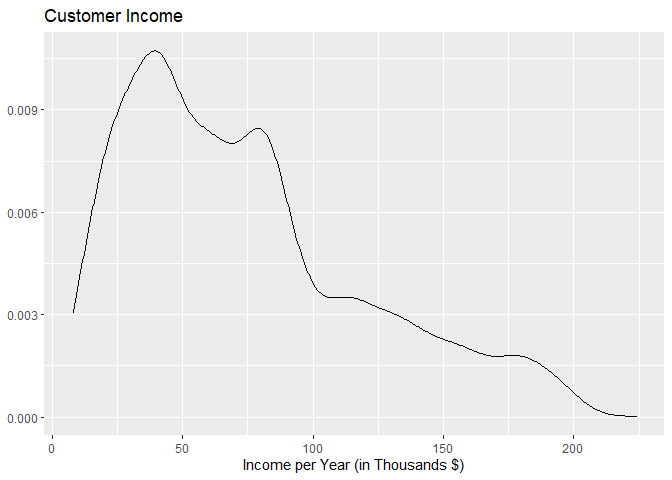
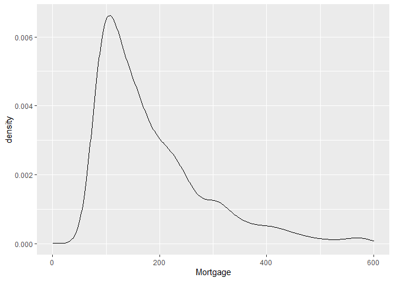

Data Cleaning - New
================

## New Project

I am working on a project created from a kaggle data set found here:
<https://www.kaggle.com/teertha/personal-loan-modeling>

I switched to this new project for a number of reasons, including:

#### Reasons:

-   The data is an easier format.
    -   No need to download additional packages, download from their
        website, etc.
-   Simpler to model.
    -   No topcoded values
    -   Raw data
-   topic is more interesting.
-   Applies to marketing better.
-   no

## Data Story

The data set is from Thera Bank customers, including demographic
information, their relationship with the bank, and their response to the
last personal loan campaign. The dataset was generated in a response to
a successful campaign by the bank to increase sign ups for their
personal loan product, with a conversion rate of 9%.

Our question is this: what factors make a consumer more likely to sign
up for a personal loan? How much do each of these factors affect the
final outcome?

With our response variable set as whether a customer signed up for a
personal loan, the following variables are available in data set:

| Variable           | Description                                                                                  |
|--------------------|----------------------------------------------------------------------------------------------|
| ID                 | Unique identifier for each person; Aribtrary numbers                                         |
| Age                | Customer’s age in completed years                                                            |
| Experience         | Number of years of professional experience                                                   |
| Income             | Annual income ($000)                                                                         |
| ZIP Code           | Home Address zip code                                                                        |
| Family             | Family size of customer                                                                      |
| CCAvg              | Avg. spending on credit cards per month ($000)                                               |
| Education          | Education Level. 1: Undergrad; 2: Graduate; 3: Advanced/Professional                         |
| Mortgage           | Value of house mortgage if any. ($000)                                                       |
| Personal Loan      | Did this customer accept the personal loan offered in the last campaign? (response variable) |
| Securities Account | Does the customer have a securities account with the bank?                                   |
| CD Account         | Does the customer have a certificate of deposit (CD) account with the bank?                  |
| Online             | Does the customer use internet banking facilities?                                           |
| CreditCard         | Does the customer use a credit card issued by this Bank?                                     |

There are no empty values in the data set. Lets take a look at the data.

## Data Exploration

    ## # A tibble: 5,000 x 14
    ##       ID   Age Experience Income `ZIP Code` Family CCAvg Education      Mortgage
    ##    <dbl> <dbl>      <dbl>  <dbl>      <dbl> <fct>  <dbl> <fct>             <dbl>
    ##  1     1    25          1     49      91107 Four     1.6 Undergrad             0
    ##  2     2    45         19     34      90089 Three    1.5 Undergrad             0
    ##  3     3    39         15     11      94720 One      1   Undergrad             0
    ##  4     4    35          9    100      94112 One      2.7 Graduate              0
    ##  5     5    35          8     45      91330 Four     1   Graduate              0
    ##  6     6    37         13     29      92121 Four     0.4 Graduate            155
    ##  7     7    53         27     72      91711 Two      1.5 Graduate              0
    ##  8     8    50         24     22      93943 One      0.3 Advanced/Prof~        0
    ##  9     9    35         10     81      90089 Three    0.6 Graduate            104
    ## 10    10    34          9    180      93023 One      8.9 Advanced/Prof~        0
    ## # ... with 4,990 more rows, and 5 more variables: Personal Loan <lgl>,
    ## #   Securities Account <lgl>, CD Account <lgl>, Online <lgl>, CreditCard <lgl>

    ##        ID            Age          Experience       Income          ZIP Code    
    ##  Min.   :   1   Min.   :23.00   Min.   :-3.0   Min.   :  8.00   Min.   : 9307  
    ##  1st Qu.:1251   1st Qu.:35.00   1st Qu.:10.0   1st Qu.: 39.00   1st Qu.:91911  
    ##  Median :2500   Median :45.00   Median :20.0   Median : 64.00   Median :93437  
    ##  Mean   :2500   Mean   :45.34   Mean   :20.1   Mean   : 73.77   Mean   :93153  
    ##  3rd Qu.:3750   3rd Qu.:55.00   3rd Qu.:30.0   3rd Qu.: 98.00   3rd Qu.:94608  
    ##  Max.   :5000   Max.   :67.00   Max.   :43.0   Max.   :224.00   Max.   :96651  
    ##    Family         CCAvg                        Education       Mortgage    
    ##  One  :1472   Min.   : 0.000   Undergrad            :2096   Min.   :  0.0  
    ##  Two  :1296   1st Qu.: 0.700   Graduate             :1403   1st Qu.:  0.0  
    ##  Three:1010   Median : 1.500   Advanced/Professional:1501   Median :  0.0  
    ##  Four :1222   Mean   : 1.938                                Mean   : 56.5  
    ##               3rd Qu.: 2.500                                3rd Qu.:101.0  
    ##               Max.   :10.000                                Max.   :635.0  
    ##  Personal Loan   Securities Account CD Account        Online       
    ##  Mode :logical   Mode :logical      Mode :logical   Mode :logical  
    ##  FALSE:4520      FALSE:4478         FALSE:4698      FALSE:2016     
    ##  TRUE :480       TRUE :522          TRUE :302       TRUE :2984     
    ##                                                                    
    ##                                                                    
    ##                                                                    
    ##  CreditCard     
    ##  Mode :logical  
    ##  FALSE:3530     
    ##  TRUE :1470     
    ##                 
    ##                 
    ## 

The data set looks good. Lets take a closer look at our distributions.
I’m curious about the customer demographics.

``` r
ggplot(data = data) +
  geom_histogram(aes(x = Age, color = Education), binwidth = 1) + 
  labs(title = "Customer Demographics", y = "Count") +
  theme_bw()
```


``` r
summary(data$Age)
```

    ##    Min. 1st Qu.  Median    Mean 3rd Qu.    Max. 
    ##   23.00   35.00   45.00   45.34   55.00   67.00

It appears we have a good spread of ages and education levels, with a
minimum age of 23, and a max of 67. It also appears we have a roughly
proportional number of different Education levels across our data set.  
This will make for some good predictions.

Lets look at the spread of income next.

``` r
ggplot(data, mapping = aes(x = Income)) +
  geom_density() +
  labs(x = "Income per Year (in Thousands $)", y = NULL, title = "Customer Income")
```



``` r
summary(data$Income)
```

    ##    Min. 1st Qu.  Median    Mean 3rd Qu.    Max. 
    ##    8.00   39.00   64.00   73.77   98.00  224.00

It appears our incomes are heavily right skewed, which is hardly
surprising. Taking a look at mortgage next:

``` r
ggplot(data) +
  geom_density(aes(x = Mortgage)) +
  xlim(c(1, 600)) # Removed large number of zeros from displaying
```

    ## Warning: Removed 3466 rows containing non-finite values (stat_density).


Please note, I removed a large number of values that were zero. Also
extremely right skewed, with a majority having paid off their mortgage.
It may be this data set is only counting mortgages with the bank, so
maybe it’s not the most reliable predictor.

``` r
ggplot(data, mapping = aes(y = Income)) +
  geom_boxplot(aes(x = Family))
```


``` r
ggplot(data, mapping = aes(x = Income)) +
  geom_histogram(fill = "white", color = "black", bins = 100) +
  facet_grid(Family ~ .) +
  labs(title = "Income Distribution vs. Family Size", y = NULL) +
  theme_bw()
```


It appears income is strangely distributed. Accounts holders with family
sizes of 1 and 2 have a much wider range in income levels. This may be
due to couples with double income, so we will have to account for this
effect later.

``` r
# data %>% group_by(`ZIP Code`) %>% 
#   summarize(.groups = 'keep',
#             avg_age = mean(Age),
#             age_sd = sd(Age),
#             avg_income = mean(Income),
#             income_sd = sd(Income),
#             avg_exp = mean(Experience),
#             exp_sd = sd(Experience),
#             avg_cc = mean(CCAvg),
#             cc_sd = sd(CCAvg),
#             avg_pl = mean(`Personal Loan`)
#             ) %>% 
#   ggplot(mapping = aes(x = avg_pl)) +
#     geom_point() +
#     facet_grid(`ZIP Code` ~ .)
```

I was interesting in examining the differences between the Zip codes, to
see if there is any significant variation between them. The
