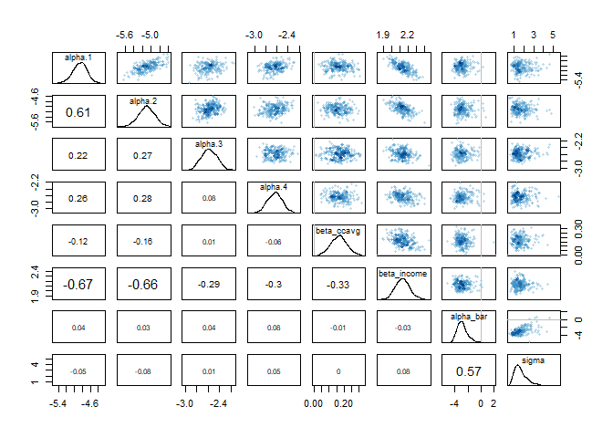

04 - New Model
================

## Fitting a Model: Multi - level with varying effects

I’m hesitant to standardize the variables, because a lot of the
variables are heavily skewed.

Using logistic regression is difficult, as interpretations are more
difficult to understand.

A multi-level model is appropriate here, because of the distribution of
the values, and the inherent heterogeneity of the marketing question.
For example, many of the values tend towards zero, such as the mortgage
value, which neccessitates a zero-inflated to more accurately capture
those values in the posterior.

I will also note that in using a logit link with a logistic regression
model allows for the interaction affects to naturally be present, since
the effects of the variables are multiplicative in the logistic model.

``` r
loan ~ Binomial(1, p)
logit(p) <- a[education] + bf[family] + m_bb * mortgage + beta_i*income + beta_c * ccavg
beta_i ~ dnorm(mu, sigma), 
mu ~ dnorm(46, sigma_i),
sigma_i ~ exponential(1),
m_bb ~ dbinom(5000, p_m),
p_m <- pi * phat_mortgage,
pi ~ gamma(k, theta),
k ~ dnorm(2, 1.5),
theta ~ exponential(1),
phat_mortgage ~ exponential(2),
beta_c ~ dnorm(mu_c, sigma_c),
mu_c ~ dnorm(0.5, 0.1),
sigma_c ~ exponential(1)
```

``` r
fit5 <- ulam(
  alist(
    loan ~ dbinom(1, p),
    logit(p) <- a[education] + bf[family] + beta_i * income,
    beta_i ~ dnorm(mu, sigma),
    mu ~ dnorm(46, sigma_i),
    sigma ~ dexp(1),
    sigma_i ~ dexp(1),
    a[education] ~ dnorm(1, 0.5),
    bf[family] ~ dnorm(0.5, 0.5)
  ),
  data = data_list,
  log_lik = TRUE,
  chains = 2,
  cores = 4,
  cmdstan = TRUE
)
```

    ## Removing one or more character or factor variables:

    ## id

    ## Compiling Stan program...

    ## Running MCMC with 2 chains, at most 4 in parallel, with 1 thread(s) per chain...

    ## Chain 1 Rejecting initial value:

    ## Chain 1   Log probability evaluates to log(0), i.e. negative infinity.

    ## Chain 1   Stan can't start sampling from this initial value.

    ## Chain 1 Iteration:   1 / 1000 [  0%]  (Warmup) 
    ## Chain 2 Iteration:   1 / 1000 [  0%]  (Warmup) 
    ## Chain 1 Iteration: 100 / 1000 [ 10%]  (Warmup) 
    ## Chain 2 Iteration: 100 / 1000 [ 10%]  (Warmup) 
    ## Chain 1 Iteration: 200 / 1000 [ 20%]  (Warmup) 
    ## Chain 1 Iteration: 300 / 1000 [ 30%]  (Warmup) 
    ## Chain 1 Iteration: 400 / 1000 [ 40%]  (Warmup) 
    ## Chain 1 Iteration: 500 / 1000 [ 50%]  (Warmup) 
    ## Chain 1 Iteration: 501 / 1000 [ 50%]  (Sampling) 
    ## Chain 1 Iteration: 600 / 1000 [ 60%]  (Sampling) 
    ## Chain 1 Iteration: 700 / 1000 [ 70%]  (Sampling) 
    ## Chain 2 Iteration: 200 / 1000 [ 20%]  (Warmup) 
    ## Chain 1 Iteration: 800 / 1000 [ 80%]  (Sampling) 
    ## Chain 1 Iteration: 900 / 1000 [ 90%]  (Sampling) 
    ## Chain 2 Iteration: 300 / 1000 [ 30%]  (Warmup) 
    ## Chain 1 Iteration: 1000 / 1000 [100%]  (Sampling) 
    ## Chain 1 finished in 206.5 seconds.
    ## Chain 2 Iteration: 400 / 1000 [ 40%]  (Warmup) 
    ## Chain 2 Iteration: 500 / 1000 [ 50%]  (Warmup) 
    ## Chain 2 Iteration: 501 / 1000 [ 50%]  (Sampling) 
    ## Chain 2 Iteration: 600 / 1000 [ 60%]  (Sampling) 
    ## Chain 2 Iteration: 700 / 1000 [ 70%]  (Sampling) 
    ## Chain 2 Iteration: 800 / 1000 [ 80%]  (Sampling) 
    ## Chain 2 Iteration: 900 / 1000 [ 90%]  (Sampling) 
    ## Chain 2 Iteration: 1000 / 1000 [100%]  (Sampling) 
    ## Chain 2 finished in 527.1 seconds.
    ## 
    ## Both chains finished successfully.
    ## Mean chain execution time: 366.8 seconds.
    ## Total execution time: 528.3 seconds.

    ## 
    ## Warning: 18 of 1000 (2.0%) transitions ended with a divergence.
    ## This may indicate insufficient exploration of the posterior distribution.
    ## Possible remedies include: 
    ##   * Increasing adapt_delta closer to 1 (default is 0.8) 
    ##   * Reparameterizing the model (e.g. using a non-centered parameterization)
    ##   * Using informative or weakly informative prior distributions

``` r
load("../Data/cache/fit3")

precis(fit5, depth = 2)
```

    ##              mean           sd       5.5%      94.5%     n_eff     Rhat4
    ## beta_i   0.040425  0.001429035  0.0382525  0.0426978 413.18096 0.9993447
    ## mu       7.095403 15.731799307 -0.9659340 46.0109945  12.50472 1.1413647
    ## sigma    2.892805  4.519385105  0.1120005 13.6781015  13.28410 1.1234820
    ## sigma_i 11.224189  4.642944442  0.4756583 16.6248825  14.79268 1.1366194
    ## a[1]    -4.832259  0.246242129 -5.2251165 -4.4433336 212.27196 1.0038520
    ## a[2]    -2.565671  0.218098280 -2.9087971 -2.2231275 192.22350 1.0043747
    ## a[3]    -2.495062  0.217054994 -2.8455402 -2.1578515 180.48873 1.0073676
    ## bf[1]   -3.262443  0.231672702 -3.6191794 -2.9066730 212.29223 1.0046929
    ## bf[2]   -3.318577  0.239870580 -3.7125131 -2.9460935 222.72555 1.0031386
    ## bf[3]   -2.081881  0.225610303 -2.4503655 -1.7271664 184.02211 1.0037566
    ## bf[4]   -2.352885  0.225565119 -2.7045645 -1.9935105 212.37871 1.0038426

``` r
compare(fit3, fit5)
```

    ##          WAIC       SE    dWAIC      dSE    pWAIC       weight
    ## fit5 1456.367 55.62917   0.0000       NA 4.333117 1.000000e+00
    ## fit3 1740.021 71.72361 283.6542 40.68761 5.588785 2.542627e-62

``` r
pairs(fit3)
```



``` r
pairs(fit5)
```


``` r
fit6 <- ulam(
  alist(
    loan ~ dbinom(1, p),
    logit(p) <- a[education] + bf[family] + beta_m * mortgage + beta_i * income,
    beta_i ~ dnorm(mu, sigma),
    mu ~ dnorm(46, sigma_i),
    sigma_i ~ dexp(1),
    p_m <- pi_m * phat_mortgage,
    beta_m ~ dbinom(20, p_m ),
    pi_m ~ dnorm(k, theta),
    k ~ dnorm(2, 1.5),
    theta ~ dexp(1),
    phat_mortgage ~ dexp(1),
    a[education] ~ dnorm(1, 0.5),
    bf[family] ~ dnorm(0.5, 0.5),
  ),
  data = data_list,
  log_lik = TRUE,
  chains = 2,
  cores = 4,
  cmdstan = TRUE
)
```

I’m not sure how to make this run, doing varying effects with logistic
regression and regularizing priors is not really clear in the book..
